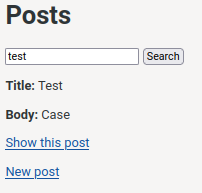

<div align = "center">

<h1><a href="https://github.com/2kabhishek/kicksearch">kicksearch</a></h1>

<a href="https://github.com/2KAbhishek/kicksearch/blob/main/LICENSE">
 </a>

<a href="https://github.com/2KAbhishek/kicksearch/graphs/contributors">
 </a>

<a href="https://github.com/2KAbhishek/kicksearch/stargazers">
</a>

<a href="https://github.com/2KAbhishek/kicksearch/network/members">
 </a>

<a href="https://github.com/2KAbhishek/kicksearch/watchers">
 </a>

<a href="https://github.com/2KAbhishek/kicksearch/pulse">
 </a>

<h3>Elasticsearch Demo with Rails 🔎💎</h3>

<figure>
  
  <br/>
  <figcaption>kicksearch in action</figcaption>
</figure>

</div>

kicksearch is a simple rails app to demonstrate the usage of Elasticsearch and Searchkik with Rails.

## ✨ Features

- Uses Searchkick for Model data search powered by Elasticsearch
- Uses turbo to render search result data

## Setup

### ⚡ Requirements

- rails 7
- a working elasticsearch instance running on port 9200

[Follow this tutorial](https://www.elastic.co/guide/en/elasticsearch/reference/current/docker.html) to install with docker.

You can disable security locally if you want by using [this config](./elasticsearch.yml)

### 🚀 Installation

```bash
git clone https://github.com/2kabhishek/kicksearch
cd kicksearch

# Setup elasticsearch config, es01 is the container name here
docker cp ./elasticsearch.yml es01:/usr/share/elasticsearch/config/elasticsearch.yml
```

### 💻 Usage

```bash
bundle install
bin/rails db:migrate
bin/rails s
```

If you do not see search results, try running `Post.reindex` from rails console.

##  Behind The Code

### 🌈 Inspiration

Was integrating elasticsearch for a work project, decided to learn by doing

### 💡 Challenges/Learnings

- Initial setup of elasticsearch with security was a bit tricky
- I learned about Searchkick and Turbo usage.

### 🧰 Tooling

- [Dotfiles](https://github.com/2kabhishek/Dotfiles) — Dev Environment
- [nvim2k](https://github.com/2kabhishek/nvim2k) — Personalized Editor

### 🔍 More Info

- [gogeo](https://github.com/2KAbhishek/gogeo) — Geocoder demo
- [swaggerize](https://github.com/2KAbhishek/swaggerize) — rswag and swagger api demo

<hr>

<div align="center">

<strong>⭐ hit the star button if you found this useful ⭐</strong><br>

<a href="https://github.com/2KAbhishek/kicksearch">Source</a>
| <a href="https://2kabhishek.github.io/blog" target="_blank">Blog </a>
| <a href="https://twitter.com/2kabhishek" target="_blank">Twitter </a>
| <a href="https://linkedin.com/in/2kabhishek" target="_blank">LinkedIn </a>
| <a href="https://2kabhishek.github.io/links" target="_blank">More Links </a>
| <a href="https://2kabhishek.github.io/projects" target="_blank">Other Projects </a>

</div>

